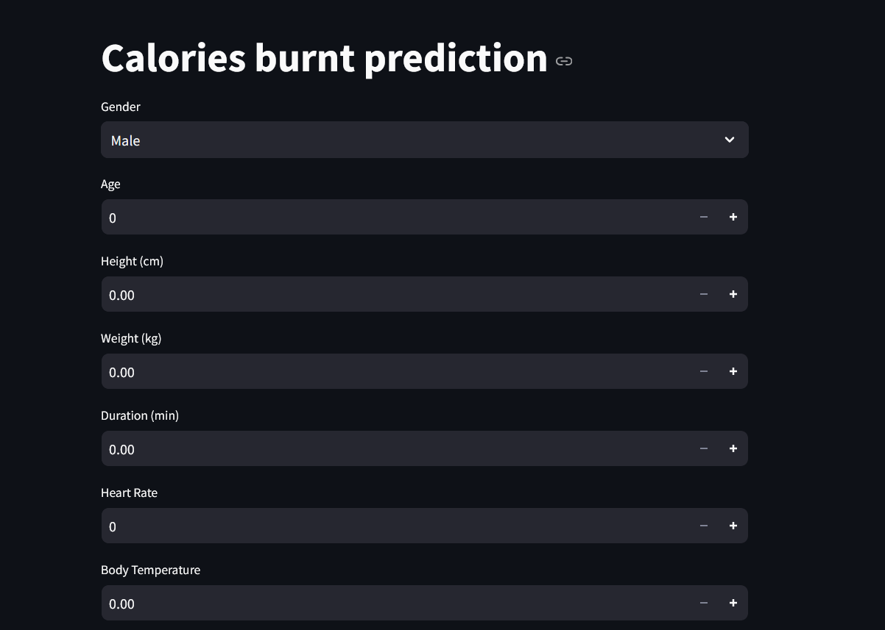
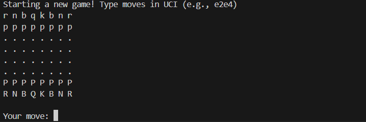

# Mohamed Ali Ben Youssef

Final-year Master’s in **Applied Mathematics & Machine Learning (Data Science)**  
Aspiring **AI Engineer / Data Scientist** — Deep Learning, Explainability, AI Safety  
**Contact:** [Email](mailto:mohamedalibenyoussef345@gmail.com) · [LinkedIn](https://www.linkedin.com/in/mohamed-ali-ben-youssef-0039a5253/) · [GitHub](https://github.com/<Mohamed-ali2001>)

---

## About
- Built ML apps end-to-end (Streamlit, notebooks), with a focus on **explainability (SHAP/LIME)** and **robustness**.  
- Internship experience in **AI Safety**: Fisher Information Matrix, Hessian sensitivity, and **fault injection** for neural networks.  
- Interested in **data products** that support decisions (dashboards, what-if analysis, content moderation, fraud/anomaly detection).

---

## 🚀 Featured Projects

<b>Calories Burnt Prediction — Streamlit + SHAP</b>

- Predicts calories burnt from biometric & activity data  
- **Explainability:** global & local SHAP, what-if sliders  
- Repo: https://github.com/<Mohamed-ali2001>/Calories-burnt-prediction  

<b>Spam Email Detection — Streamlit</b>

- NLP classifier with precision/recall, keyword highlights  
- Repo: https://github.com/<Mohamed-ali2001>/mail_spam_prediction  

<b>Sign Language Tracking — CNN + Hand-tracking</b>

- Real-time sign recognition (~90% acc.) via webcam  
- Repo: https://github.com/<Mohamed-ali2001>/Sign_langage_tracking  

<b>Personalized Chess Game Analyzer</b>

- Parses PGN, labels moves (*blunder, mistake, best…*), DL model predicts next move  
- +200 Elo improvement from targeted practice  
- Repo: https://github.com/<Mohamed-ali2001>/Chessbot-me  

---

## 🧰 Skills (compact)

**Python, SQL, TensorFlow, scikit-learn, NLP, Computer Vision, SHAP/LIME, Git, Power BI, Azure, LLM**

---

## 🎓 Certifications  

